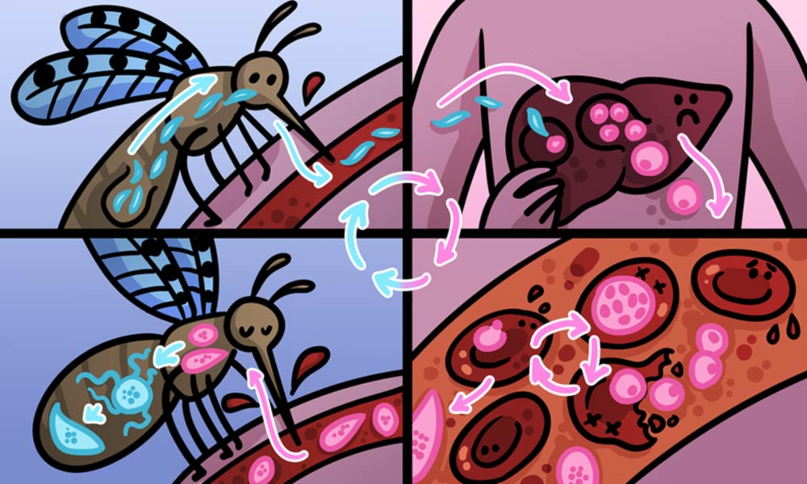

## Malaria detection using CNN and data augmentation

### Objective:
The aim of this project is to distingulish if a person was infeacted with the Malaria from a microscopic image, and provide support for the lab examination results to quickly diagnosis the Malaria parasites.

## Malaria
Malaria is caused by Plasmodium parasites. The parasites are spread to people through the bites of infected female Anopheles mosquitoes, called "malaria vectors." 

Generally, the first symptoms of Malaria is fever, headache, and chills, but these symptoms usually appear after 10-15 days after the infective mosquito bite. 

In addition, the symptoms can be mild or severe and different for children and adult, which make it very difficult to recognize the malaria. **For example**, children with severe malaria frequently develop one or more of the following symptoms: severe anaemia, respiratory distress in relation to metabolic acidosis, or cerebral malaria. In adults, multi-organ failure is also frequent. In malaria endemic areas, people may develop partial immunity, allowing asymptomatic infections to occur.

### Diagnosis of Malaria can be difficult

1 Where malaria is not endemic any more (such as in the United States), health-care providers may not be familiar with the disease. Clinicians seeing a malaria patient may forget to consider malaria among the potential diagnoses and not order the needed diagnostic tests. Laboratorians may lack experience with malaria and fail to detect parasites when examining blood smears under the microscope.

2 In some malaria-endemic areas, malaria transmission is so intense that a large proportion of the population is infected but not made ill by the parasites. Such carriers have developed just enough immunity to protect them from malarial illness but not from malarial infection. In that situation, finding malaria parasites in an ill person does not necessarily mean that the illness is caused by the parasites.

There are multiple ways to diagnosis the Malaria parasites, such as Clinical diagnosis, Microscopic Diagnosis, Antigen detection, Molecular diagnosis,Serology and Drug resistance tests. 

**Thus, to develop a automated and robust system to diagnosis the Malaria parasites is emergent and can speed up the traditional way of malaria parasite diagnosis. In this project, we focus on approach named the Microscopic Diagnosis.**

### Microscopic Diagnosis

Microscopic Diagnosis is to identify the Malaria parasites by examining under the microscope a drop of the patient’s blood, spread out as a “blood smear” on a microscope slide. Prior to examination, the specimen is stained to give the parasites a distinctive appearance. This technique remains the gold standard for laboratory confirmation of malaria. However, it depends on the quality of the reagents, of the microscope, and on the experience of the laboratorian.

## Data
The data was obtained from [kaggle](https://www.kaggle.com/iarunava/cell-images-for-detecting-malaria). Originally, the data was taken from the official [NIH Website](https://ceb.nlm.nih.gov/repositories/malaria-datasets/).

There are two folders which contained the infected and uninfected malaria microscopic images.

## Method summary

    1 Download data

    2 Data exploration

    3 Data prepraration

    4 Data split into train, validate and test data sets

    5 Model building and evaluation: original data and data augumentation

**Note**: I used my local computer to run this anlysis which took a long time to run, maybe changed to a better computer resources such as Google Colab could save time.

## References
CDC [Microscopic Diagnosis](https://www.cdc.gov/malaria/diagnosis_treatment/diagnostic_tools.html#tabs-1-1)

WHO [Malaria](https://www.who.int/news-room/fact-sheets/detail/malaria)

Malaria Cell Atlas: mapping a murderous parasite’s [life cycle](https://sangerinstitute.blog/2019/08/22/malaria-cell-atlas-mapping-a-murderous-parasites-life-cycle/)

